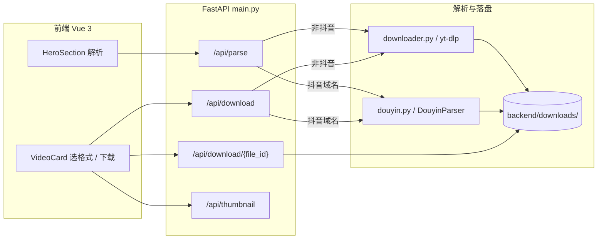

# 视频下载功能实现总结

本文档沉淀当前 **映鉴（Kinema）** 项目中「粘贴链接 → 解析 → 本地下载」的已实现能力、模块分工与接口约定，便于维护与二次开发。

**与代码同步**：`v0523` — 新增 JWT 用户认证、Stripe 买断 VIP、免费/VIP 格式过滤与下载限流；`v0515` — 优化前端页面，让其变得更加紧凑（解析结果与总结双栏同屏、解析后自动流式总结、导航与 Hero / 结果区纵向间距收紧）。前端组件要点见 §6。

---

## 1. 用户侧流程

1. 在首页输入框粘贴视频页或分享链接（`http` / `https`）。
2. 前端调用 **`POST /api/parse`**，展示标题、作者、时长、封面、可选清晰度等。
3. 用户选择格式后点击下载，前端调用 **`POST /api/download`**；成功后用返回的 `file_id` 拼出 **`GET /api/download/{file_id}`** 触发浏览器下载。
4. 封面图通过 **`GET /api/thumbnail?url=...`** 由后端代理，减轻 Referer / 跨域导致的裂图问题。

---

## 2. 总体架构

---

## 3. 两条解析与下载路径

| 维度 | 通用站点（yt-dlp） | 抖音（Douyin） |
|------|-------------------|----------------|
| **入口判断** | `main.py` 中 `is_douyin_url(url)` 为假 | `douyin.com`、`v.douyin.com`、`iesdouyin.com` 等域名 |
| **实现模块** | `backend/downloader.py` | `backend/douyin.py` |
| **解析** | `YoutubeDL.extract_info(..., download=False)`，汇总 `formats` | 短链/正文提 URL → 重定向 → `video_id` → 公开接口取元数据，构造与前端兼容的 `formats` |
| **Cookie** | 支持 `backend/cookies.txt` 或从本机浏览器读 Cookie（见下文） | 模块设计为不依赖登录 Cookie（仍受平台策略与风控影响） |
| **格式选择** | 多档 `format_id`（含「最佳画质」、合并音视频 DASH 等） | 通常单档 `format_id: douyin_nowm`（无水印说明见代码注释） |
| **落盘文件名** | `%(id)s.%(ext)s` 等，与 yt-dlp 一致；展示名来自标题 | 磁盘文件名为 `{video_id}.mp4`，下载展示名由标题清洗得到 |
| **转码** | 下载后若视频轨非「常见可播」编码，可 **ffmpeg 原地转 H.264**（见 §5） | 当前路径不经过该转码逻辑 |

---

## 4. HTTP API 约定

### 4.1 `POST /api/parse`

- **请求体**：`{ "url": "<用户输入>" }`
- **成功**：`{ "code": 0, "data": { ... } }`  
  `data` 字段与前端 `VideoCard` 一致，核心包括：`title`、`thumbnail`、`duration`、`uploader`、`extractor`、`description`、`view_count`、`formats[]`（每项含 `format_id`、`ext`、`resolution`、`filesize`、`quality_note` 等）。
- **失败**：HTTP 400，`detail` 为人类可读说明；对 Cookie、不支持链接、私密/不可用等场景在 `main.py` 中有专门映射。

### 4.2 `POST /api/download`

- **请求体**：`{ "url": "<同一视频链接>", "format_id": "<解析结果中的 format_id>" }`
- **成功**：`{ "code": 0, "file_id": "<与 downloads 下文件 stem 一致>", "filename": "<建议保存名>" }`
- **说明**：抖音下载会再次走解析与直链拉取；`format_id` 仍参与请求以保持接口统一，实际逻辑以 `douyin.py` 为准。

### 4.3 `GET /api/download/{file_id}`

- **查询参数**：`fn`（可选，用于 `Content-Disposition` 展示文件名）。
- **行为**：在 `backend/downloads/` 下按 `file_id` 匹配文件名 stem，返回 `FileResponse`（当前 `media_type` 固定为 `video/mp4`）。

### 4.4 `GET /api/thumbnail?url=...`

- 后端用 `httpx` 拉取缩略图并回传，`Referer` 使用原图 URL，缓解部分站点防盗链。

---

## 5. 通用下载路径关键实现（`downloader.py`）

### 5.1 解析阶段的格式列表

- 抽取 **音视频合一** 的按高度档位（如 `720p`）。
- **仅视频轨**（DASH）时按高度优选一条，并优先考虑 **H.264 / AV1 / HEVC** 等兼容性排序（`_vcodec_compat_rank`）。
- 若无合适合一格式，则用 **`video_only + bestaudio`** 形式的合成 `format_id`（标注「合并音视频」等说明）。
- 列表顶部插入 **「最佳画质」**，对应内部常量 **`_FORMAT_BEST_COMPAT`**：优先 H.264 合并链路，再回退通用 best。

### 5.2 下载选项

- 输出目录：`DOWNLOAD_DIR`（`backend/downloads/`）。
- 合并容器：`merge_output_format: mp4`；重试、分片、`Referer` / `Origin` 等与站点 HTTP 行为相关的参数已加固。

### 5.3 下载后兼容性（ffmpeg）

- 使用 **ffprobe** 判断主导视频编码；若为 AV1 / HEVC 等「非主流播放器友好」编码，则用 **ffmpeg** 将视频轨转 **libx264**，音频拷贝，原地替换文件。
- **未安装 ffmpeg** 时的转码会失败并抛出明确错误（见运行时提示）。

### 5.4 临时文件生命周期

- 后台线程周期性执行 **`cleanup_old_files()`**（默认约 **1 小时** 过期，间隔 **600 秒**），避免磁盘被占满。生产环境若需长期保留，需单独调整策略。

### 5.5 Cookie（需登录类站点）

- **优先** `backend/cookies.txt`（Netscape 格式）。
- **否则**尝试从本机浏览器读取 Cookie（代码中配置了浏览器优先级列表）；部分站点解析失败时会提示关闭浏览器或导出 `cookies.txt`。

---

## 6. 前端要点

- **`src/api/index.js`**：`axios` `baseURL: '/api'`，解析超时 120s，下载触发 600s。
- **`App.vue`**：保存当前解析用 `currentUrl`，下载时连同所选 `format_id` 提交；成功后用隐藏的 `<a download>` 打开 `/api/download/{file_id}?fn=...`；解析成功后可自动发起流式总结；大屏下 `VideoCard` 与 `SummaryPanel` 双栏同屏（约 40:60），小屏纵向堆叠。
- **`VideoCard.vue`**：缩略图走 `/api/thumbnail`；格式默认选中列表第一项（一般为「最佳画质」）；工作台嵌入模式下为上图下文与单列清晰度列表，减少横向占用。
- **`SummaryPanel.vue`**：字幕、思维导图、AI 问答等 Tab；嵌入模式下收紧内边距与 Tab 高度以配合首屏展示。

---

## 7. 会员与权限（v0523）

| 模块 | 文件 | 说明 |
|------|------|------|
| 用户库 | `database.py` | SQLite：`users`、`purchases`、`download_logs`、`processed_stripe_events` |
| 认证 | `auth.py` | JWT 注册/登录；`get_optional_user` 供解析接口可选带 Token |
| 支付 | `billing.py` | Stripe Checkout 一次性 CNY；Webhook 开通/撤销 VIP |
| 权益 | `membership.py` | `filter_formats()` 免费最高 720p；`validate_download_format()` 下载二次校验 |
| 限流 | `rate_limit.py` | 免费用户每日 3 次下载（UTC 日切） |

**解析**：`POST /api/parse` 若携带 Bearer Token，按用户 VIP 状态调用 `apply_tier_to_parse_result()`，返回 `tier` 与可选 `quality_notice`（如 Cookie 失效仅 480p、免费用户 1080p 锁定提示）。

**下载**：`POST /api/download` 需登录；后端重新解析并校验 `format_id` 是否属于当前用户档位。

**YouTube 画质**：高清晰度依赖有效 `backend/cookies.txt`；Cookie 失效时 VIP 与免费用户均可能只看到 480p，与会员状态无关。

---

## 8. 依赖与本地运行（摘要）

详见仓库根目录 [README](../README.md)。后端需：`fastapi`、`uvicorn`、`yt-dlp`、`httpx` 等（见 `backend/requirements.txt`）。  
**强烈推荐**安装 **ffmpeg**（PATH 可查），以保证非 H.264 成片可播。

---

## 9. 合规与风险提示

本项目用于技术学习与自用工具演示。请遵守来源平台的服务条款与版权法律，勿将能力用于未授权的大规模爬取或再分发。

抖音等平台接口与反爬策略会变更， **`douyin.py` 的稳定期无法保证**，需持续关注与适配。

---

*文档版本与仓库实现一致时可随代码迭代更新本文件。*
